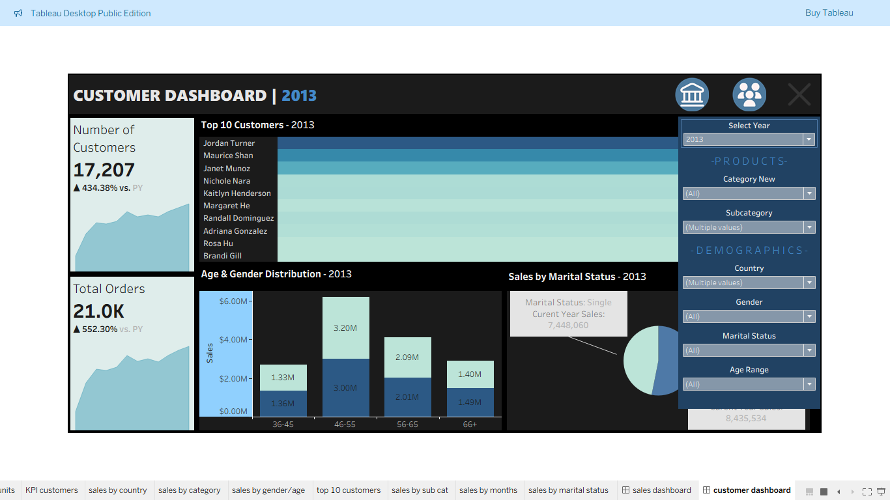

# Tableau Sales & Customer Dashboard (2011–2013)

This project presents an interactive Tableau dashboard built as a visual analytics layer on top of a SQL-based ETL pipeline. It offers a comprehensive view of sales performance and customer behavior from **2011 to 2013**. The dashboards include dynamic filters to allow stakeholders to drill into product, geography, and demographic data with ease.

---

## Purpose

The aim of this project is to deliver business-ready insights by transforming raw CRM and ERP data through a structured SQL ETL pipeline and visualizing it using Tableau. This dashboard helps stakeholders make informed decisions by answering critical sales and customer-related questions.

---

## Business Questions Answered

### Sales Dashboard
- ✅ What are the total sales, units sold, and average order value over time?
- ✅ How do these KPIs trend month-by-month across the selected years?
- ✅ Which countries drive the most sales?
- ✅ What are the top-performing product categories and sub-categories?
- ✅ How does performance compare to the previous year?

### Customer Dashboard
- ✅ Who are the top customers by order volume?
- ✅ How many customers and orders were there by year?
- ✅ How do gender and age groups contribute to total sales?
- ✅ Do marital statuses show different buying behaviors?
- ✅ How do customer demographics vary by product category or country?

---

## Features

- **Filter by Year**: Analyze sales from **2011 to 2013**.
- **Filter by Geography**: Select specific countries for analysis.
- **Product Filters**: Choose categories and subcategories of interest.
- **Demographic Filters**: Filter by gender, age range, and marital status.
- **Dynamic KPIs**: Auto-updated key metrics based on filters applied.
- **Top N Analysis**: Highlight top 10 customers and top sub-categories.

---

## Dashboards Overview

### **Sales Dashboard**
- KPIs: Total Sales, Units Sold, Average Order Value (AOV)
- Visuals:
  - Sales Trend Over Time
  - Sales per Country
  - Sales by Category
  - Top 10 Sub-Categories

### **Customer Dashboard**
- KPIs: Number of Customers, Total Orders
- Visuals:
  - Top 10 Customers
  - Sales by Age & Gender
  - Sales by Marital Status
- Filters:
  - Year, Country, Gender, Age Range, Category, Subcategory, Marital Status

---

## Integration

This dashboard is an **extension** of the [SQL Data Warehouse ETL Pipeline Project](https://github.com/Seanmaraks02/sql_dw_project), which structured raw CRM and ERP data into business-ready data models using a three-layer pipeline: **Bronze → Silver → Gold**.

---

## 🔗 Live Dashboards on Tableau Public

- 🔹 [Sales Dashboard (2011–2013)](https://public.tableau.com/views/SalesDash_17514129941140/salesdashboard?:language=en-US&publish=yes&:sid=&:redirect=auth&:display_count=n&:origin=viz_share_link) ⭐️⭐️⭐️⭐️⭐️
  > Explore total sales, unit trends, country performance, and product categories with clean visuals and monthly breakdowns.

- 🔹 [Customer Dashboard (2011–2013)](https://public.tableau.com/views/SalesDash_17514129941140/customerdashboard?:language=en-US&publish=yes&:sid=&:redirect=auth&:display_count=n&:origin=viz_share_link) ⭐️⭐️⭐️⭐️⭐️  
  > Dive into customer counts, top buyers, demographic insights, and marital status analysis—perfect for customer segmentation.

---

## Dashboard Screenshots

| Sales Dashboard | Customer Dashboard |
|-----------------|--------------------|
|  |  |

---

> ⚠️ Dashboard `.twb` files are not included in this repository. Please use the **Tableau Public links** to interact with the dashboards.

---

## Future Enhancements

- Add comparison across multiple years (YoY growth %).
- Implement tooltips and story highlights for deeper context.
- Export filtered views to PDF for reporting.
- Create a mobile-friendly version.

---

## License

This project is licensed under the MIT License. See the [LICENSE](LICENSE) file for more information.

---

## Author

**Sean Marakalala**  
Business Intelligence & Data Analytics  
[LinkedIn](hwww.linkedin.com/in/sean-marakalala-569291200) • [GitHub](https://github.com/Seanmaraks02)
